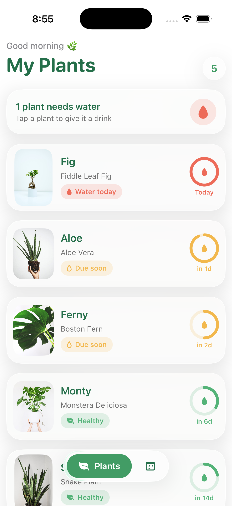
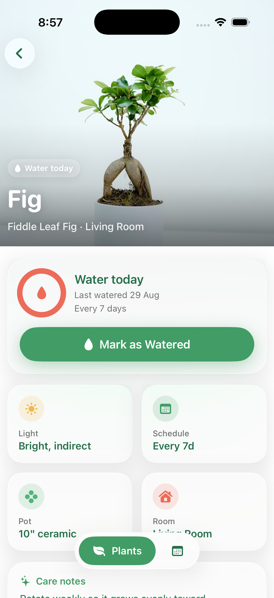
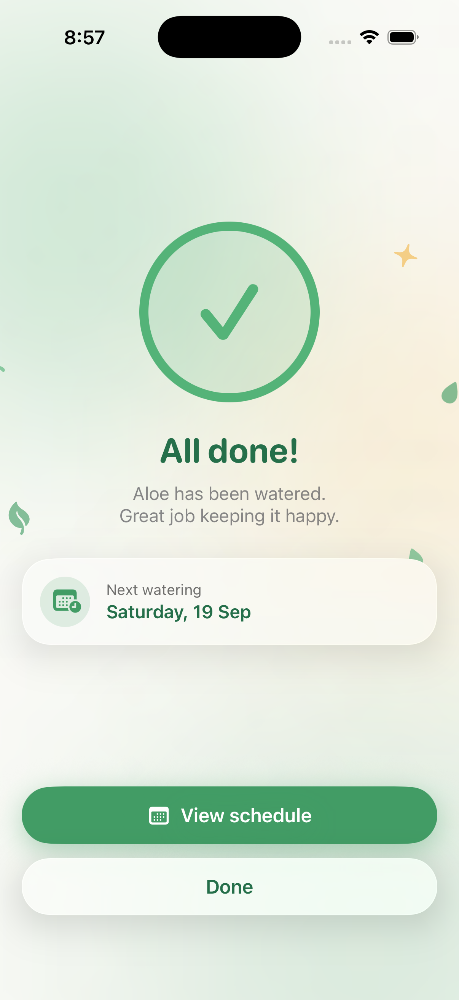
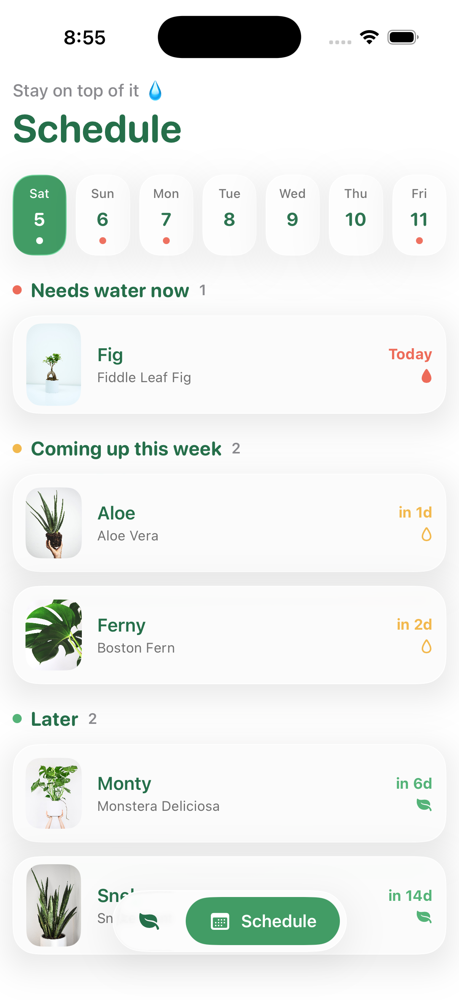

# PlantPal Mobile App

A functional iOS prototype designed on figma, developed and prototyped using AI-assisted coding with Claude Code. I used Claude Code to accelerate implementation while directing the product architecture, UX, interaction design, visual system, and iterative refinement.

**Tools:** Figma · Claude Code · Xcode 

## Project Overview

PlantPal is a modern iOS plant care app designed to help users easily track their plants, watering schedules, and care routines in one simple experience.

## Design Process

I focused on creating a visually engaging and intuitive experience, combining iOS design patterns with a glassmorphic visual system. I mapped the core user flow, designed the four key screens, and used SwiftUI with AI-assisted development to turn the designs into a functional, clickable prototype.

## Figma Link

https://www.figma.com/design/aACG3O09hnKSjU0zjT9pyV/Plant-Pal?node-id=0-1&p=f&t=RCdESrsHiHNGXhPF-0

## Screens

<table>
  <tr>
    <td align="center" width="50%">
       
      <b>Home</b> — plants sorted by urgency, with scannable watering status
    </td>
    <td align="center" width="50%">
       
      <b>Detail</b> — hero photo, moisture ring, and care info
    </td>
  </tr>
  <tr>
    <td align="center" width="50%">
       
      <b>Watered</b> — celebratory confirmation with next watering date
    </td>
    <td align="center" width="50%">
       
      <b>Schedule</b> — upcoming waterings grouped by urgency
    </td>
  </tr>
</table>

## Video Prototype Demo

https://github.com/user-attachments/assets/9e280cd4-3a72-4d09-8008-1b1e7c247e0e

> If the video above doesn't play inline, [download / watch it here](Video%20Prototype%20Demo/PlantPal-Prototype-Demo.mp4).
